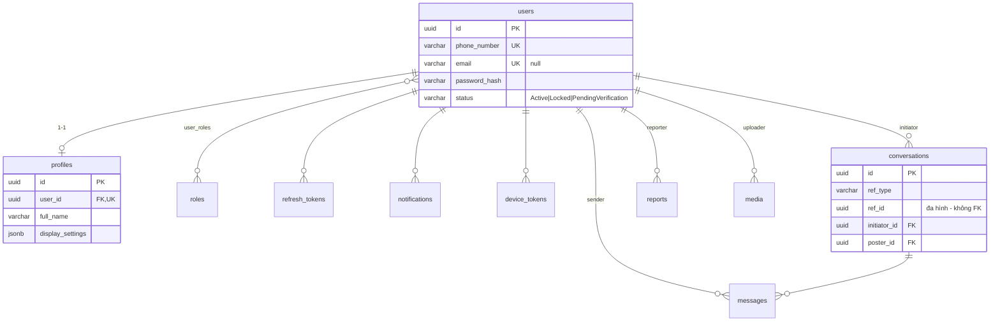
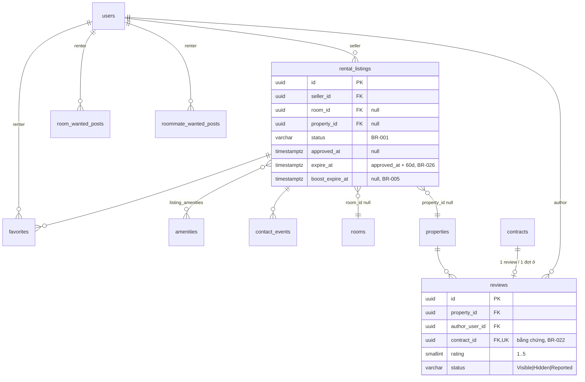
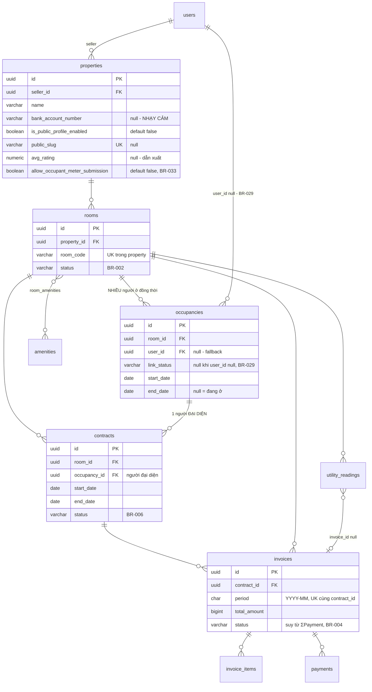
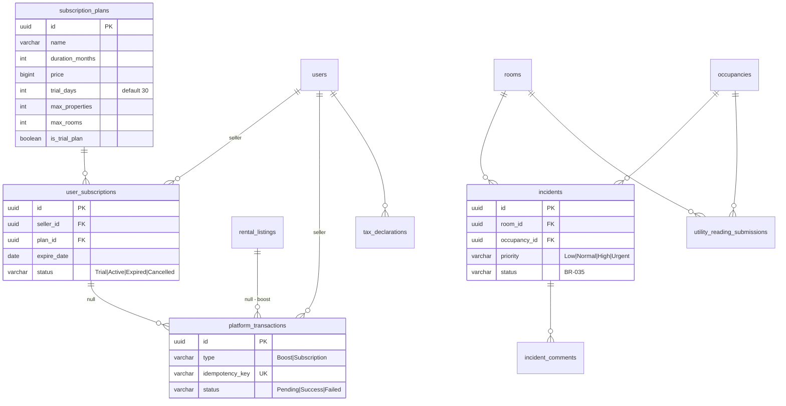

# Trọ Nhanh — Phân tích nghiệp vụ & Thiết kế cơ sở dữ liệu

**Đối tượng đọc:** team Backend (Java Spring Boot) dựng schema, và BA/PO rà nghiệp vụ.
**Trạng thái:** bản thiết kế để bàn và chốt — **chưa phải DDL cuối cùng**. Team BE sở hữu
schema thật; file này là đầu vào, không phải mệnh lệnh.

**Nguồn chân lý nghiệp vụ** (repo frontend, thư mục `.agents/business/`):
`BUSINESS_RULES.md` (BR-001→BR-035) · `DATA_ENTITIES.md` · `STATUS_ENUMS.md` ·
`VALIDATION_RULES.md` · `API_CONTRACT.md` · `BACKEND_SERVICES.md` · `SURFACES_AND_MODES.md`.

Khi file này mâu thuẫn với `.agents/business/`, **tài liệu nghiệp vụ thắng** — và hãy báo lại
để sửa file này.

> **Cách đọc nhanh:** §1–§2 cho BA · §3 ERD cho người muốn thấy toàn cảnh · §4 chi tiết cột
> cho người viết migration · §6–§8 là phần dễ bị bỏ sót nhất và cũng tốn kém nhất nếu sai ·
> §10 là danh sách câu hỏi **cần chốt trước khi gõ dòng DDL đầu tiên**.

---

## 1. Bối cảnh nghiệp vụ

Trọ Nhanh có **hai trụ cột** dùng chung một tài khoản:

| Trụ cột                                                                            | Cho ai                      | Thu tiền                                    |
| ---------------------------------------------------------------------------------- | --------------------------- | ------------------------------------------- |
| **Marketplace** — tìm phòng, đăng tin cho thuê, tin nhu cầu, nhắn tin              | Người thuê + người đăng tin | **Miễn phí**; chỉ thu phí _đẩy tin nổi bật_ |
| **Workspace (SaaS)** — khu trọ, phòng, người ở, hợp đồng, điện nước, hóa đơn, thuế | Chủ trọ                     | **Thuê bao**, có bản dùng thử               |

Cộng thêm **Residency** — lớp trải nghiệm cho người đang ở trọ (xem hóa đơn của mình, báo sự
cố, gửi chỉ số điện nước). Đây là _module đọc_ dựa trên dữ liệu Workspace, không phải domain
thứ ba.

### 1.1 Ranh giới domain

Một codebase, **một database**; mỗi service là một module có ranh giới rõ, giao tiếp qua
interface nội bộ (`BACKEND_SERVICES.md`). Điều này ảnh hưởng thiết kế DB ở chỗ: các bảng vẫn
nằm chung một schema, nhưng **quyền sở hữu ghi** thuộc đúng một service.

| Nhóm                       | Service sở hữu                                                                                                    | Bảng                                                                                                                                                                                                                    |
| -------------------------- | ----------------------------------------------------------------------------------------------------------------- | ----------------------------------------------------------------------------------------------------------------------------------------------------------------------------------------------------------------------- |
| Shared Kernel              | `AuthService`, `UserProfileService`, `MediaService`, `NotificationService`, `MessagingService`                    | `users`, `roles`, `user_roles`, `profiles`, `refresh_tokens`, `media`, `notifications`, `conversations`, `messages`, `device_tokens`                                                                                    |
| Marketplace                | `ListingService`, `DemandPostService`, `FavoriteService`, `ReviewService`, `ModerationService`                    | `rental_listings`, `room_wanted_posts`, `roommate_wanted_posts`, `favorites`, `reviews`, `reports`, `contact_events`, `amenities`, `banned_keywords`                                                                    |
| Property Management (SaaS) | `PropertyRoomService`, `OccupancyContractService`, `BillingService`, `SubscriptionService`, `AnalyticsTaxService` | `properties`, `rooms`, `occupancies`, `contracts`, `invoices`, `invoice_items`, `utility_readings`, `payments`, `subscription_plans`, `user_subscriptions`, `platform_transactions`, `tax_settings`, `tax_declarations` |
| Residency                  | `ResidencyService`                                                                                                | `incidents`, `incident_comments`, `utility_reading_submissions`                                                                                                                                                         |

**Điểm nối duy nhất giữa Marketplace và SaaS:** `rental_listings.room_id` (nullable) và
`rental_listings.property_id` (nullable). `Room` và `RentalListing` là **hai thực thể độc
lập** — một phòng có thể chưa bao giờ được đăng tin, một tin có thể không gắn phòng nào.

### 1.2 Ba khái niệm định danh (hay bị lẫn)

| Khái niệm           | Bản chất                                                                            | Lưu ở đâu                    |
| ------------------- | ----------------------------------------------------------------------------------- | ---------------------------- |
| **Role**            | `Renter` · `Seller` · `Admin` · `Moderator` — **cộng dồn**, không loại trừ (BR-013) | `user_roles`                 |
| **workspaceStatus** | `NONE` / `TRIAL` / `ACTIVE` / `READ_ONLY` — **suy ra**, không lưu                   | tính từ `user_subscriptions` |
| **residencyStatus** | `NONE` / `PENDING` / `ACTIVE` / `PAST` — **suy ra**, không lưu                      | tính từ `occupancies`        |

> **Không tạo cột `workspace_status` hay `residency_status`.** Chúng là giá trị dẫn xuất; lưu
> cứng nghĩa là có hai nguồn sự thật và sớm muộn sẽ lệch. Đặc biệt **không tạo role
> `Resident`** — người ở vẫn là `Renter`, chỉ khác ở quan hệ `Occupancy`.

### 1.3 Nguyên tắc tiền bạc

Nền tảng **không giữ tiền thuê** (AS-002). Hóa đơn kèm số tài khoản + VietQR, người ở chuyển
thẳng cho chủ trọ, chủ trọ tự bấm "Đã thu". Hệ quả lên DB:

- `payments` là **ghi nhận thủ công**, không phải giao dịch cổng thanh toán.
- `platform_transactions` mới là giao dịch qua cổng — và chỉ cho **phí nền tảng** (đẩy tin,
  thuê bao). Hai bảng này **không được gộp**.

---

## 2. Nguyên tắc thiết kế chung

| Chủ đề         | Quyết định đề xuất                                           | Lý do                                                                                              |
| -------------- | ------------------------------------------------------------ | -------------------------------------------------------------------------------------------------- |
| Hệ quản trị    | PostgreSQL                                                   | Cần `daterange` + `EXCLUDE` cho ràng buộc chồng lấn hợp đồng (§6), `jsonb` cho vài trường cấu hình |
| Khóa chính     | `uuid` (v7 nếu được)                                         | ID không đoán được; v7 giữ tính tuần tự cho index                                                  |
| Đặt tên        | `snake_case`, **tên bảng số nhiều**                          | Thống nhất toàn hệ thống                                                                           |
| Mốc thời gian  | `created_at`, `updated_at` — `timestamptz`, mặc định `now()` |                                                                                                    |
| Xóa mềm        | `deleted_at timestamptz null` trên **mọi bảng nghiệp vụ**    | BR-011, và "không bao giờ mất dữ liệu vận hành của chủ trọ" (BR-015)                               |
| Tiền           | `bigint`, **đơn vị đồng, không phần thập phân**              | VND không dùng đơn vị nhỏ hơn; `numeric` chỉ tổ mời sai số và tranh cãi làm tròn                   |
| Ngày nghiệp vụ | `date` (`start_date`, `end_date`, `due_date`)                | Hợp đồng tính theo ngày, không theo giây                                                           |
| Sự kiện        | `timestamptz` lưu UTC; hiển thị theo `Asia/Ho_Chi_Minh`      |                                                                                                    |
| Kỳ hóa đơn     | `char(7)` dạng `YYYY-MM`                                     | Khớp `VALIDATION_RULES.md`                                                                         |
| Enum           | `varchar` + `CHECK (col IN (...))`                           | Enum gốc Postgres rất khó sửa/xóa giá trị về sau; `CHECK` sửa bằng một migration                   |
| Cô lập dữ liệu | Mọi truy vấn SaaS lọc theo `seller_id`                       | BR-007 — xem §9                                                                                    |

### 2.1 Kiểu enum: vì sao không dùng `CREATE TYPE`

Tập trạng thái ở đây **sẽ đổi**: `Room.status` từng có giá trị `Repairing` rồi bị bỏ; V2 dự
kiến thêm phản hồi đánh giá. Với enum gốc Postgres, thêm giá trị thì được nhưng **xóa hoặc
đổi tên là phải dựng lại type và mọi cột phụ thuộc**. `varchar` + `CHECK` cho cùng mức an
toàn mà sửa chỉ tốn một migration. Ứng dụng vẫn khai enum Java tương ứng.

---

## 3. Sơ đồ quan hệ (ERD)

Tách bốn cụm cho dễ đọc. Ký hiệu: `||--o{` = một–nhiều, `}o--o{` = nhiều–nhiều,
`||--o|` = một–không hoặc một.

### 3.1 Định danh & Shared Kernel



### 3.2 Marketplace



### 3.3 Property Management (SaaS)



> **Điểm hay bị mô hình hóa sai:** `rooms → occupancies` là **một–nhiều**. Một phòng có nhiều
> người ở đồng thời (bạn cùng phòng, cả gia đình), mỗi người một bản ghi `Occupancy` riêng với
> SĐT riêng và `link_status` riêng. `Contract` gắn **đúng một** Occupancy đại diện. Đừng gộp
> thành "một người ở kèm cột `occupant_count`" — làm vậy thì không liên kết được tài khoản
> Renter cho từng người, và toàn bộ BR-029/BR-034 sụp.

### 3.4 Thuê bao, thuế, Residency



---

## 4. Chi tiết bảng

Quy ước cột chung, **không lặp lại ở từng bảng**:

```
id           uuid        PK, default gen_random_uuid()
created_at   timestamptz not null default now()
updated_at   timestamptz not null default now()
deleted_at   timestamptz null            -- bảng nghiệp vụ; bảng danh mục có thể bỏ
```

### 4.1 Định danh

**`users`**

| Cột             | Kiểu           | Null | Ràng buộc / mặc định                 | Ghi chú                                     |
| --------------- | -------------- | ---- | ------------------------------------ | ------------------------------------------- |
| `phone_number`  | `varchar(15)`  | ✗    | UNIQUE (partial, xem §6)             | Định danh đăng ký + kênh OTP (BR-016)       |
| `email`         | `varchar(255)` | ✓    | UNIQUE (partial)                     | Tùy chọn, thêm ở Profile                    |
| `password_hash` | `varchar(255)` | ✗    |                                      | bcrypt hoặc argon2                          |
| `status`        | `varchar(24)`  | ✗    | CHECK, default `PendingVerification` | `PendingVerification` / `Active` / `Locked` |

**`roles`** — danh mục 4 dòng: `Renter`, `Seller`, `Admin`, `Moderator`. `name` UNIQUE.

**`user_roles`** — bảng nối. PK kép `(user_id, role_id)`. **Cộng dồn, không loại trừ**: một
user vừa `Renter` vừa `Seller` là bình thường và phổ biến.

**`profiles`**

| Cột                | Kiểu           | Null | Ràng buộc          | Ghi chú                                      |
| ------------------ | -------------- | ---- | ------------------ | -------------------------------------------- |
| `user_id`          | `uuid`         | ✗    | FK `users`, UNIQUE | 1-1                                          |
| `full_name`        | `varchar(120)` | ✗    |                    |                                              |
| `avatar_url`       | `text`         | ✓    |                    |                                              |
| `contact_phone`    | `varchar(15)`  | ✓    |                    | Chưa đặt → prefill bằng `users.phone_number` |
| `display_settings` | `jsonb`        | ✗    | default `'{}'`     | Toggle dashboard (BR-012)                    |

**`refresh_tokens`**

| Cột          | Kiểu           | Null | Ghi chú                           |
| ------------ | -------------- | ---- | --------------------------------- |
| `user_id`    | `uuid`         | ✗    | FK                                |
| `token_hash` | `varchar(255)` | ✗    | **Lưu hash, không lưu token thô** |
| `expires_at` | `timestamptz`  | ✗    |                                   |
| `revoked_at` | `timestamptz`  | ✓    | Thu hồi khi logout                |

### 4.2 Marketplace

**`rental_listings`** — tin cho thuê

| Cột                                                               | Kiểu           | Null | Ràng buộc / mặc định          | Ghi chú                                            |
| ----------------------------------------------------------------- | -------------- | ---- | ----------------------------- | -------------------------------------------------- |
| `seller_id`                                                       | `uuid`         | ✗    | FK `users`                    |                                                    |
| `room_id`                                                         | `uuid`         | ✓    | FK `rooms`                    | Gắn phòng → chịu BR-027                            |
| `property_id`                                                     | `uuid`         | ✓    | FK `properties`               | **Phải cùng `seller_id`** — kiểm ở service         |
| `title`                                                           | `varchar(120)` | ✗    | CHECK độ dài ≥ 10             |                                                    |
| `property_type`                                                   | `varchar(24)`  | ✗    | CHECK                         | `BoardingRoom` / `ServicedApartment` / `Apartment` |
| `address`                                                         | `varchar(255)` | ✗    |                               |                                                    |
| `province_code` / `ward_code`                                     | `int`          | ✓    |                               | **Xem §10.1** — mô hình hành chính 2 cấp           |
| `district`                                                        | `varchar(120)` | ✓    |                               | Tên hiển thị; **tên cột gây hiểu nhầm**, xem §10.1 |
| `area`                                                            | `numeric(6,2)` | ✗    | CHECK > 0                     | m²                                                 |
| `price`                                                           | `bigint`       | ✗    | CHECK > 0                     | đ/tháng                                            |
| `electricity_price` / `water_price` / `service_price` / `deposit` | `bigint`       | ✓    | CHECK ≥ 0                     |                                                    |
| `description`                                                     | `text`         | ✓    |                               |                                                    |
| `access_policy`                                                   | `varchar(12)`  | ✗    | CHECK, default `Free`         | `Free` / `Restricted` (BR-025)                     |
| `access_open_time` / `access_close_time`                          | `time`         | ✓    | **bắt buộc khi `Restricted`** | CHECK điều kiện                                    |
| `contact_phone`                                                   | `varchar(15)`  | ✗    |                               |                                                    |
| `status`                                                          | `varchar(20)`  | ✗    | CHECK, default `Draft`        | BR-001                                             |
| `reject_reason`                                                   | `text`         | ✓    |                               | Bắt buộc khi `Rejected`                            |
| `approved_at`                                                     | `timestamptz`  | ✓    |                               |                                                    |
| `expire_at`                                                       | `timestamptz`  | ✓    |                               | `approved_at + 60d` (BR-026) — xem §10.5           |
| `boost_expire_at`                                                 | `timestamptz`  | ✓    |                               | Còn hạn → xếp trước (BR-005)                       |

**`room_wanted_posts`** — tin tìm phòng

`renter_id` FK · `desired_districts jsonb` · `price_min` / `price_max bigint` ·
`property_type varchar` · `min_area numeric` · `desired_amenities jsonb` · `move_in_date date`
· `description text` · `status varchar` (BR-001) · `expire_at timestamptz` (30 ngày — BR-009).

**`roommate_wanted_posts`** — tin ở ghép

`renter_id` FK · `current_address varchar` · `district varchar` · `share_price bigint` ·
`needed_count smallint` · `gender_requirement varchar` · `requirements text` ·
`status varchar` · `expire_at timestamptz`.

> BR-010: mỗi Renter tối đa **2 tin Active mỗi loại**. Không cưỡng chế được bằng constraint
> thường — xem §8.

**`favorites`** — `renter_id` FK · `listing_id` FK · UNIQUE `(renter_id, listing_id)`.

**`contact_events`** — `listing_id` FK · `user_id` FK **null** (khách vãng lai) ·
`type varchar` CHECK `Call|Message`. Bảng chỉ ghi thêm, phục vụ thống kê.

**`reviews`** — đánh giá khu trọ

| Cột              | Kiểu            | Null | Ràng buộc                | Ghi chú                                                      |
| ---------------- | --------------- | ---- | ------------------------ | ------------------------------------------------------------ |
| `property_id`    | `uuid`          | ✗    | FK                       |                                                              |
| `author_user_id` | `uuid`          | ✗    | FK                       | **CHECK ≠ `properties.seller_id`** (BR-022) — kiểm ở service |
| `contract_id`    | `uuid`          | ✗    | FK, **UNIQUE**           | Bằng chứng đã ở thật; 1 review / 1 đợt ở (BR-023)            |
| `rating`         | `smallint`      | ✗    | CHECK 1–5                |                                                              |
| `content`        | `varchar(1000)` | ✓    |                          |                                                              |
| `status`         | `varchar(12)`   | ✗    | CHECK, default `Visible` | `Visible` / `Hidden` / `Reported`                            |
| `seller_reply`   | `text`          | ✓    |                          | **V2**, tạo cột sẵn được                                     |

**`reports`** — `reporter_id` FK · `target_type varchar` CHECK (6 giá trị) · `target_id uuid`
(**đa hình, không FK**) · `reason varchar` · `description text` · `status varchar`
(`Pending|Resolved|Dismissed`) · `resolution text` · `handled_by uuid` FK null.

**`amenities`** — danh mục. `name` · `icon` · `type varchar` CHECK `Room|Surrounding`.
Hai bảng nối: **`listing_amenities`** `(listing_id, amenity_id)` và **`room_amenities`**
`(room_id, amenity_id)`.

**`banned_keywords`** — `keyword varchar` UNIQUE · `is_active boolean`.

### 4.3 Property Management (SaaS)

**`properties`** — khu trọ

| Cột                                                           | Kiểu           | Null | Ràng buộc / mặc định   | Ghi chú                           |
| ------------------------------------------------------------- | -------------- | ---- | ---------------------- | --------------------------------- |
| `seller_id`                                                   | `uuid`         | ✗    | FK `users`             | Trục cô lập dữ liệu (BR-007)      |
| `name`                                                        | `varchar(120)` | ✗    | CHECK độ dài ≥ 2       |                                   |
| `address`                                                     | `varchar(255)` | ✓    |                        |                                   |
| `province_code` / `ward_code`                                 | `int`          | ✓    |                        | Xem §10.1                         |
| `district`                                                    | `varchar(120)` | ✓    |                        | **Bắt buộc khi bật public**       |
| `floor_count`                                                 | `smallint`     | ✓    |                        |                                   |
| `note`                                                        | `text`         | ✓    |                        |                                   |
| `bank_name`                                                   | `varchar(60)`  | ✓    |                        | 🔒 **Nhạy cảm**                   |
| `bank_account_number`                                         | `varchar(20)`  | ✓    | CHECK chỉ chữ số       | 🔒 **Nhạy cảm**                   |
| `bank_account_name`                                           | `varchar(120)` | ✓    | CHECK IN HOA không dấu | 🔒 Chuẩn VietQR bắt buộc          |
| `is_public_profile_enabled`                                   | `boolean`      | ✗    | default `false`        | Opt-in (BR-024)                   |
| `public_slug`                                                 | `varchar(160)` | ✓    | UNIQUE (partial)       | Tự sinh                           |
| `avg_rating`                                                  | `numeric(2,1)` | ✓    |                        | **Dẫn xuất** — xem §8             |
| `review_count`                                                | `int`          | ✗    | default 0              | **Dẫn xuất**                      |
| `allow_occupant_meter_submission`                             | `boolean`      | ✗    | default `false`        | BR-033, đặt ở cấp khu có chủ đích |
| `electricity_unit_price` / `water_unit_price` / `service_fee` | `bigint`       | ✓    |                        | ⚠️ **Đề xuất thêm — xem §10.2**   |

> 🔒 Ba cột ngân hàng khiến bảng này **không bao giờ được `SELECT *` ra API công khai**. Xem §9.

**`rooms`** — phòng

| Cột                                                   | Kiểu           | Null | Ràng buộc                                 | Ghi chú                                                      |
| ----------------------------------------------------- | -------------- | ---- | ----------------------------------------- | ------------------------------------------------------------ |
| `property_id`                                         | `uuid`         | ✗    | FK                                        |                                                              |
| `room_code`                                           | `varchar(20)`  | ✗    | UNIQUE `(property_id, room_code)` partial |                                                              |
| `floor`                                               | `smallint`     | ✗    | CHECK 0–100, default 1                    |                                                              |
| `area`                                                | `numeric(6,2)` | ✗    | CHECK > 0                                 |                                                              |
| `price`                                               | `bigint`       | ✗    | CHECK **≥ 0**                             | ≥ 0 chứ không > 0: phòng cho người nhà ở nhờ là dữ liệu thật |
| `status`                                              | `varchar(12)`  | ✗    | CHECK, default `Available`                | BR-002 — **đúng 4 giá trị**                                  |
| `access_policy`                                       | `varchar(12)`  | ✓    | CHECK                                     |                                                              |
| `access_open_time` / `access_close_time`              | `time`         | ✓    |                                           |                                                              |
| `note`                                                | `text`         | ✓    |                                           | Ghi chú nội bộ, không lộ ra Marketplace                      |
| `electricity_price` / `water_price` / `service_price` | `bigint`       | ✓    |                                           | ⚠️ §10.2. **`null` = theo giá khu, khác `0` = miễn phí**     |

**`occupancies`** — người ở

| Cột              | Kiểu           | Null | Ràng buộc                      | Ghi chú                                 |
| ---------------- | -------------- | ---- | ------------------------------ | --------------------------------------- |
| `room_id`        | `uuid`         | ✗    | FK                             |                                         |
| `user_id`        | `uuid`         | ✓    | FK `users`                     | `null` = thêm tay, chưa có tài khoản    |
| `link_status`    | `varchar(12)`  | ✓    | CHECK `Pending                 | Confirmed                               | Rejected` | **`null` ⟺ `user_id` null** — CHECK ràng buộc chéo |
| `full_name`      | `varchar(120)` | ✗    |                                |                                         |
| `phone_number`   | `varchar(15)`  | ✗    |                                |                                         |
| `start_date`     | `date`         | ✗    |                                |                                         |
| `end_date`       | `date`         | ✓    | CHECK `end_date >= start_date` | `null` = đang ở                         |
| `occupant_count` | `smallint`     | ✗    | default 1                      | Số nhân khẩu của **bản ghi này**        |
| `note`           | `text`         | ✓    |                                |                                         |
| `is_active`      | `boolean`      | ✗    |                                | ⚠️ Trùng lặp với `end_date` — xem §10.3 |

**`contracts`** — hợp đồng

| Cột                       | Kiểu          | Null | Ràng buộc                     | Ghi chú                                       |
| ------------------------- | ------------- | ---- | ----------------------------- | --------------------------------------------- |
| `room_id`                 | `uuid`        | ✗    | FK                            |                                               |
| `occupancy_id`            | `uuid`        | ✗    | FK `occupancies`              | Người **đại diện**; phải thuộc cùng `room_id` |
| `start_date` / `end_date` | `date`        | ✗    | CHECK `end_date > start_date` |                                               |
| `rent_price` / `deposit`  | `bigint`      | ✗    | CHECK ≥ 0                     |                                               |
| `status`                  | `varchar(12)` | ✗    | CHECK, default `Draft`        | BR-006                                        |
| `terminate_reason`        | `text`        | ✓    |                               | Bắt buộc khi `Terminated`                     |

> **Ràng buộc đắt giá nhất của cả schema:** mỗi phòng tối đa **một** hợp đồng `Active`, và
> **không chồng lấn thời gian**. Đây là chỗ duy nhất nên dùng `EXCLUDE` — xem §6.

**`invoices`** — hóa đơn kỳ

| Cột            | Kiểu          | Null | Ràng buộc                                                     | Ghi chú                             |
| -------------- | ------------- | ---- | ------------------------------------------------------------- | ----------------------------------- |
| `room_id`      | `uuid`        | ✗    | FK                                                            |                                     |
| `contract_id`  | `uuid`        | ✗    | FK                                                            |                                     |
| `period`       | `char(7)`     | ✗    | CHECK `~ '^\d{4}-\d{2}$'`, **UNIQUE `(contract_id, period)`** |                                     |
| `due_date`     | `date`        | ✗    |                                                               |                                     |
| `total_amount` | `bigint`      | ✗    | CHECK ≥ 0                                                     | **= Σ `invoice_items.amount`** — §8 |
| `status`       | `varchar(16)` | ✗    | CHECK, default `Unpaid`                                       | **Suy từ ΣPayment** (BR-004) — §8   |

**`invoice_items`** — `invoice_id` FK · `type varchar` CHECK
(`Rent|Electricity|Water|Service|Deposit|Other`) · `description varchar` ·
`quantity numeric(10,2)` · `unit_price bigint` · `amount bigint`.

**`utility_readings`** — chỉ số điện nước

| Cột                                    | Kiểu            | Null | Ràng buộc                            | Ghi chú                                |
| -------------------------------------- | --------------- | ---- | ------------------------------------ | -------------------------------------- |
| `room_id`                              | `uuid`          | ✗    | FK                                   |                                        |
| `type`                                 | `varchar(12)`   | ✗    | CHECK `Electricity                   | Water`                                 |     |
| `period`                               | `char(7)`       | ✗    | **UNIQUE `(room_id, type, period)`** |                                        |
| `previous_reading` / `current_reading` | `numeric(10,2)` | ✗    | CHECK `current >= previous`          |                                        |
| `unit_price`                           | `bigint`        | ✗    | CHECK ≥ 0                            | **Chốt giá tại thời điểm ghi** — §10.2 |
| `invoice_id`                           | `uuid`          | ✓    | FK                                   | `null` = chưa lên hóa đơn              |

**`payments`** — `invoice_id` FK **bắt buộc** · `amount bigint` CHECK > 0 ·
`method varchar` CHECK `Cash|BankTransfer` · `paid_at timestamptz` · `note text`.

### 4.4 Thuê bao, giao dịch, thuế

**`subscription_plans`** — `name` · `duration_months int` · `price bigint` ·
`renewal_price bigint` · `trial_days int` default 30 · `max_properties int` ·
`max_rooms int` · `is_trial_plan boolean` · `is_active boolean`.

> Hạn mức bản dùng thử **lấy từ plan có `is_trial_plan = true`**, không hardcode trong code.

**`user_subscriptions`** — `seller_id` FK · `plan_id` FK · `start_date date` ·
`expire_date date` · `status varchar` CHECK `Trial|Active|Expired|Cancelled`.

**`platform_transactions`** — phí nền tảng qua cổng thanh toán

| Cột                    | Kiểu           | Null | Ràng buộc      | Ghi chú                   |
| ---------------------- | -------------- | ---- | -------------- | ------------------------- |
| `seller_id`            | `uuid`         | ✗    | FK             |                           |
| `type`                 | `varchar(16)`  | ✗    | CHECK `Boost   | Subscription`             |         |
| `listing_id`           | `uuid`         | ✓    | FK             | Khi `type = Boost`        |
| `user_subscription_id` | `uuid`         | ✓    | FK             | Khi `type = Subscription` |
| `amount`               | `bigint`       | ✗    |                |                           |
| `status`               | `varchar(12)`  | ✗    | CHECK `Pending | Success                   | Failed` |     |
| `gateway_txn_id`       | `varchar(120)` | ✓    |                |                           |
| `idempotency_key`      | `varchar(120)` | ✗    | **UNIQUE**     | Webhook phải idempotent   |
| `paid_at`              | `timestamptz`  | ✓    |                |                           |

**`tax_settings`** — `year int` · `threshold_revenue bigint` · `vat_rate numeric(5,4)` ·
`pit_rate numeric(5,4)` · `is_active boolean`.

**`tax_declarations`** — `seller_id` FK · `year int` · `total_revenue bigint` (**cash basis** —
ΣPayment trong năm, BR-021) · `vat_amount` · `pit_amount` · `generated_file_url text` null.

### 4.5 Thông báo, media, Residency

**`notifications`** — `user_id` FK · `type varchar` (14 giá trị, xem §5) · `title` ·
`content text` · `is_read boolean` default false · `ref_type varchar` · `ref_id uuid`.

**`media`** — `owner_type varchar` CHECK (8 giá trị) · `owner_id uuid` **null khi mới upload**
· `url text` · `mime_type` · `size_bytes bigint` · `is_private boolean` default false.

> Media chưa gắn owner sau **24 giờ** bị job dọn. Cần index trên `(owner_id, created_at)`
> `WHERE owner_id IS NULL`.

**`incidents`** — `room_id` FK · `occupancy_id` FK · `reported_by_user_id` FK ·
`title varchar(120)` CHECK độ dài ≥ 5 · `description varchar(2000)` ·
`priority varchar` CHECK `Low|Normal|High|Urgent` · `status varchar` CHECK (5 giá trị,
BR-035) · `resolved_at timestamptz` null.

**`incident_comments`** — `incident_id` FK · `author_user_id` FK · `content text` ·
`is_from_seller boolean`.

**`utility_reading_submissions`** — đề xuất chỉ số từ người ở (BR-033)

| Cột                                                 | Kiểu            | Null | Ghi chú                                        |
| --------------------------------------------------- | --------------- | ---- | ---------------------------------------------- |
| `room_id` / `occupancy_id` / `submitted_by_user_id` | `uuid`          | ✗    | FK                                             |
| `type`                                              | `varchar(12)`   | ✗    | `Electricity                                   | Water`   |
| `period`                                            | `char(7)`       | ✗    |                                                |
| `submitted_value`                                   | `numeric(10,2)` | ✗    | **Giữ nguyên số gốc kể cả khi chủ sửa**        |
| `photo_media_id`                                    | `uuid`          | ✗    | FK `media` — **ảnh đồng hồ bắt buộc**          |
| `status`                                            | `varchar(12)`   | ✗    | `Pending                                       | Approved | Rejected` |
| `reviewed_by_user_id`                               | `uuid`          | ✓    |                                                |
| `approved_value`                                    | `numeric(10,2)` | ✓    | Số chủ trọ chốt, có thể khác `submitted_value` |
| `reject_reason`                                     | `text`          | ✓    |                                                |

**`device_tokens`** — `user_id` FK · `token varchar` **UNIQUE** · `platform varchar`
CHECK `iOS|Android` · `last_active_at timestamptz`.

---

## 5. Bảng enum tập trung

Giá trị phải khớp **chính xác** chuỗi này ở cả DB, API và client. Không tự dịch, không tự thêm.

| Cột                                      | Giá trị                                                                                                                                                                                                                                                              |
| ---------------------------------------- | -------------------------------------------------------------------------------------------------------------------------------------------------------------------------------------------------------------------------------------------------------------------- |
| `users.status`                           | `PendingVerification` · `Active` · `Locked`                                                                                                                                                                                                                          |
| `roles.name`                             | `Renter` · `Seller` · `Admin` · `Moderator`                                                                                                                                                                                                                          |
| `rental_listings.status`, tin nhu cầu    | `Draft` · `PendingApproval` · `Active` · `Rejected` · `Expired` · `Rented` · `Hidden`                                                                                                                                                                                |
| `rental_listings.property_type`          | `BoardingRoom` · `ServicedApartment` · `Apartment`                                                                                                                                                                                                                   |
| `access_policy`                          | `Free` · `Restricted`                                                                                                                                                                                                                                                |
| `rooms.status`                           | `Available` · `Deposited` · `Rented` · `Hidden` — **đúng 4, không có `Repairing`**                                                                                                                                                                                   |
| `occupancies.link_status`                | `Pending` · `Confirmed` · `Rejected` (hoặc `null`)                                                                                                                                                                                                                   |
| `contracts.status`                       | `Draft` · `Active` · `Expired` · `Terminated`                                                                                                                                                                                                                        |
| `invoices.status`                        | `Unpaid` · `PartiallyPaid` · `Paid` · `Overdue`                                                                                                                                                                                                                      |
| `invoice_items.type`                     | `Rent` · `Electricity` · `Water` · `Service` · `Deposit` · `Other`                                                                                                                                                                                                   |
| `utility_readings.type`                  | `Electricity` · `Water`                                                                                                                                                                                                                                              |
| `payments.method`                        | `Cash` · `BankTransfer`                                                                                                                                                                                                                                              |
| `reviews.status`                         | `Visible` · `Hidden` · `Reported`                                                                                                                                                                                                                                    |
| `reports.status`                         | `Pending` · `Resolved` · `Dismissed`                                                                                                                                                                                                                                 |
| `reports.target_type`                    | `RentalListing` · `RoomWantedPost` · `RoommateWantedPost` · `Conversation` · `Message` · `Review`                                                                                                                                                                    |
| `conversations.status`                   | `Active` · `Archived` · `Blocked`                                                                                                                                                                                                                                    |
| `user_subscriptions.status`              | `Trial` · `Active` · `Expired` · `Cancelled`                                                                                                                                                                                                                         |
| `platform_transactions.type` / `.status` | `Boost` · `Subscription` / `Pending` · `Success` · `Failed`                                                                                                                                                                                                          |
| `incidents.status`                       | `Open` · `Acknowledged` · `InProgress` · `Resolved` · `Closed`                                                                                                                                                                                                       |
| `incidents.priority`                     | `Low` · `Normal` · `High` · `Urgent`                                                                                                                                                                                                                                 |
| `utility_reading_submissions.status`     | `Pending` · `Approved` · `Rejected`                                                                                                                                                                                                                                  |
| `media.owner_type`                       | `RentalListing` · `RoommateWantedPost` · `Contract` · `Profile` · `Invoice` · `TaxDeclaration` · `Incident` · `UtilityReadingSubmission`                                                                                                                             |
| `notifications.type`                     | `ListingApproved` · `ListingRejected` · `NewMessage` · `ContractExpiring` · `InvoiceDue` · `InvoiceOverdue` · `InvoiceReceived` · `SubscriptionRenewal` · `TrialEnding` · `ReviewModerated` · `OccupancyLinked` · `ListingAutoRented` · `FavoriteChanged` · `System` |
| `amenities.type`                         | `Room` · `Surrounding`                                                                                                                                                                                                                                               |
| `device_tokens.platform`                 | `iOS` · `Android`                                                                                                                                                                                                                                                    |

---

## 6. Ràng buộc **phải** cưỡng chế ở tầng DB

Những thứ dưới đây nếu chỉ kiểm ở tầng ứng dụng thì hai request đồng thời sẽ lách qua.

### 6.1 Unique + xóa mềm — cái bẫy kinh điển

Xóa mềm biến **mọi** unique constraint thành sai. Xóa phòng `P101` rồi tạo lại `P101` phải
được, nhưng `UNIQUE (property_id, room_code)` thường sẽ chặn vì dòng cũ vẫn nằm đó.

**Luôn dùng partial unique index:**

```sql
CREATE UNIQUE INDEX uq_rooms_property_code
  ON rooms (property_id, room_code) WHERE deleted_at IS NULL;

CREATE UNIQUE INDEX uq_users_phone
  ON users (phone_number) WHERE deleted_at IS NULL;

CREATE UNIQUE INDEX uq_users_email
  ON users (email) WHERE deleted_at IS NULL AND email IS NOT NULL;

CREATE UNIQUE INDEX uq_properties_slug
  ON properties (public_slug) WHERE deleted_at IS NULL AND public_slug IS NOT NULL;
```

### 6.2 Danh sách unique đầy đủ

| Bảng                          | Ràng buộc                                                     | Nguồn              |
| ----------------------------- | ------------------------------------------------------------- | ------------------ |
| `users`                       | `phone_number`; `email` (nullable)                            | BR-016             |
| `rooms`                       | `(property_id, room_code)`                                    | VALIDATION_RULES   |
| `invoices`                    | `(contract_id, period)`                                       | DATA_ENTITIES      |
| `utility_readings`            | `(room_id, type, period)`                                     | DATA_ENTITIES      |
| `reviews`                     | `contract_id`                                                 | BR-023             |
| `favorites`                   | `(renter_id, listing_id)`                                     | DATA_ENTITIES      |
| `conversations`               | `(initiator_id, ref_type, ref_id)`                            | BR-019             |
| `platform_transactions`       | `idempotency_key`                                             | Webhook idempotent |
| `device_tokens`               | `token`                                                       | DATA_ENTITIES      |
| `properties`                  | `public_slug`                                                 | BR-024             |
| `profiles`                    | `user_id`                                                     | 1-1                |
| `user_subscriptions`          | **1 bản dùng thử / seller** — partial `WHERE status='Trial'`… | BR-015, xem dưới   |
| `utility_reading_submissions` | **1 `Pending` / `(room_id, type, period)`** — partial         | VALIDATION_RULES   |

```sql
-- Mỗi Seller chỉ được dùng thử MỘT lần trong đời, kể cả sau khi bản dùng thử hết hạn.
-- Vì vậy điều kiện là "plan dùng thử", KHÔNG phải "status = Trial".
CREATE UNIQUE INDEX uq_one_trial_per_seller
  ON user_subscriptions (seller_id)
  WHERE plan_id IN (SELECT id FROM subscription_plans WHERE is_trial_plan);
-- ⚠️ Postgres không cho subquery trong index predicate.
--    Cách chạy được: thêm cột dẫn xuất `is_trial boolean` trên user_subscriptions
--    (ghi lúc tạo), rồi: ... ON user_subscriptions (seller_id) WHERE is_trial;

CREATE UNIQUE INDEX uq_pending_submission
  ON utility_reading_submissions (room_id, type, period)
  WHERE status = 'Pending' AND deleted_at IS NULL;
```

### 6.3 Chống chồng lấn hợp đồng (BR-006)

Đây là ràng buộc **không** thay thế được bằng kiểm tra ở tầng ứng dụng: hai yêu cầu tạo hợp
đồng gửi cùng lúc đều đọc thấy "chưa có hợp đồng nào chồng lấn" rồi cùng ghi.

```sql
CREATE EXTENSION IF NOT EXISTS btree_gist;

ALTER TABLE contracts ADD CONSTRAINT no_overlapping_active_contract
  EXCLUDE USING gist (
    room_id WITH =,
    daterange(start_date, end_date, '[]') WITH &&
  ) WHERE (status = 'Active' AND deleted_at IS NULL);
```

Ràng buộc này đồng thời bảo đảm "mỗi Room tối đa 1 Contract Active".

### 6.4 CHECK ràng buộc chéo cột

```sql
-- link_status chỉ có nghĩa khi đã gắn tài khoản (BR-029)
ALTER TABLE occupancies ADD CONSTRAINT link_status_requires_user
  CHECK ((user_id IS NULL) = (link_status IS NULL));

-- Giờ ra vào bắt buộc khi giới hạn giờ giấc (BR-025)
ALTER TABLE rental_listings ADD CONSTRAINT access_time_required
  CHECK (access_policy <> 'Restricted'
         OR (access_open_time IS NOT NULL AND access_close_time IS NOT NULL));

-- Lý do từ chối bắt buộc khi bị từ chối
ALTER TABLE rental_listings ADD CONSTRAINT reject_reason_required
  CHECK (status <> 'Rejected' OR reject_reason IS NOT NULL);

-- Giao dịch nền tảng phải trỏ đúng một đối tượng theo loại
ALTER TABLE platform_transactions ADD CONSTRAINT txn_target_matches_type
  CHECK ((type = 'Boost'        AND listing_id IS NOT NULL AND user_subscription_id IS NULL)
      OR (type = 'Subscription' AND user_subscription_id IS NOT NULL AND listing_id IS NULL));

ALTER TABLE utility_readings ADD CONSTRAINT reading_not_decreasing
  CHECK (current_reading >= previous_reading);

ALTER TABLE contracts ADD CONSTRAINT contract_dates
  CHECK (end_date > start_date);

ALTER TABLE occupancies ADD CONSTRAINT occupancy_dates
  CHECK (end_date IS NULL OR end_date >= start_date);
```

---

## 7. Chỉ mục đề xuất

| Bảng                          | Index                                                                         | Phục vụ                               |
| ----------------------------- | ----------------------------------------------------------------------------- | ------------------------------------- |
| `rental_listings`             | `(status, ward_code, price, property_type)`                                   | Bộ lọc tìm phòng                      |
| `rental_listings`             | `(boost_expire_at DESC NULLS LAST, approved_at DESC)` `WHERE status='Active'` | Xếp hạng BR-005                       |
| `rental_listings`             | `(seller_id, status)`                                                         | "Tin của tôi"                         |
| `rental_listings`             | `(room_id)` `WHERE room_id IS NOT NULL`                                       | Đồng bộ BR-027                        |
| `rooms`                       | `(property_id, status)`                                                       | Lưới phòng + đếm theo trạng thái      |
| `properties`                  | `(seller_id)` `WHERE deleted_at IS NULL`                                      | Cô lập BR-007                         |
| `occupancies`                 | `(room_id)`, `(user_id, link_status)`                                         | Người ở của phòng; "phòng của tôi"    |
| `contracts`                   | `(room_id, status)`, `(end_date)` `WHERE status='Active'`                     | Job nhắc hết hạn                      |
| `invoices`                    | `(contract_id, period)` UK, `(status, due_date)`                              | Job Overdue                           |
| `utility_readings`            | `(room_id, type, period)` UK, `(invoice_id)` `WHERE invoice_id IS NULL`       | Chỉ số chưa lên hóa đơn               |
| `payments`                    | `(invoice_id)`, `(paid_at)`                                                   | Suy `invoice.status`; thuế cash basis |
| `notifications`               | `(user_id, is_read, created_at DESC)`                                         | Hộp thông báo                         |
| `messages`                    | `(conversation_id, created_at)`                                               | Cuộn hội thoại                        |
| `conversations`               | `(initiator_id, ref_type, ref_id)` UK, `(poster_id, last_message_at DESC)`    |                                       |
| `reviews`                     | `(property_id, status)`                                                       | Trang khu public                      |
| `incidents`                   | `(room_id, status)`                                                           | Hộp thư sự cố                         |
| `utility_reading_submissions` | `(room_id, period, status)`                                                   | Hàng đợi duyệt                        |
| `media`                       | `(owner_type, owner_id)`; `(created_at)` `WHERE owner_id IS NULL`             | Job dọn media mồ côi                  |
| `refresh_tokens`              | `(user_id)`, `(token_hash)`                                                   |                                       |

Tìm kiếm toàn văn tiêu đề/mô tả tin: cân nhắc `pg_trgm` hoặc `tsvector` — **chưa chốt**, phụ
thuộc yêu cầu "tìm kiếm < 1.5s" ở `NON_FUNCTIONAL.md`.

---

## 8. Bất biến **không** cưỡng chế được bằng constraint

Những luật dưới đây cần **transaction**, **trigger**, hoặc **job định kỳ**. Liệt kê ra đây để
không ai tưởng schema đã lo hết.

| Mã                  | Luật                                                                                                             | Cách làm đề xuất                                                           |
| ------------------- | ---------------------------------------------------------------------------------------------------------------- | -------------------------------------------------------------------------- |
| **BR-004**          | `invoices.status` suy từ Σ`payments.amount` so với `total_amount` và `due_date`                                  | Trigger sau INSERT/UPDATE/DELETE trên `payments`; **client không tự tính** |
| —                   | `invoices.total_amount` = Σ`invoice_items.amount`                                                                | Trigger, hoặc tạo hóa đơn chỉ qua một thủ tục duy nhất                     |
| **BR-027**          | Room → `Rented` thì listing gắn nó → `Rented` **cùng transaction** + Notification                                | Trong service, một transaction                                             |
| **BR-031**          | Tạo Contract `Active` → Room → `Rented` cùng transaction                                                         | Trong service                                                              |
| **BR-022**          | Quyền viết review: Occupancy `Confirmed` + Contract ≥ 30 ngày **hoặc** đã có ≥ 1 Payment; cấm tự review khu mình | Kiểm ở service trước khi ghi                                               |
| **BR-018 / BR-023** | Tin hoặc review có ≥ 3 report chưa xử lý → tự ẩn                                                                 | Trigger đếm, hoặc job                                                      |
| **BR-026**          | `expire_at = approved_at + 60 ngày`; quá hạn → `Expired`                                                         | Ghi lúc duyệt + job quét — xem §10.5                                       |
| **BR-009**          | Tin nhu cầu 30 ngày → `Expired`                                                                                  | Job                                                                        |
| **BR-010**          | Tối đa 2 tin Active mỗi loại / Renter                                                                            | Kiểm ở service (partial unique không biểu diễn được "≤ 2")                 |
| **BR-028**          | `users.status = Locked` → mọi tin Active → `Hidden`; mở khóa **không** tự bật lại                                | Trong service                                                              |
| **BR-011**          | Không xóa Property còn Room `Rented`/`Deposited` hoặc Contract Active                                            | Kiểm ở service                                                             |
| **BR-015**          | Hạn mức `max_properties` / `max_rooms`; over-limit chỉ chặn tạo mới                                              | Guard ở service                                                            |
| **BR-006**          | Job chuyển Contract quá `end_date` → `Expired` + Notification                                                    | Job                                                                        |
| **BR-024**          | `properties.avg_rating` / `review_count`                                                                         | Trigger trên `reviews`, hoặc job — xem §10.8                               |
| **BR-021**          | Doanh thu tính thuế = ΣPayment **trong năm** (cash basis)                                                        | Truy vấn theo `payments.paid_at`                                           |

---

## 9. Bảo mật & riêng tư ảnh hưởng schema

**BR-007 — cô lập theo `seller_id`.** Mọi truy vấn dữ liệu SaaS **phải** kèm điều kiện
`seller_id = :currentUser`. Dữ liệu vận hành của hai chủ trọ không bao giờ được xuất hiện
trong cùng một kết quả. Đề xuất: một lớp repository chung ép sẵn điều kiện này, thay vì trông
vào việc mỗi lập trình viên nhớ viết.

**⚠️ `properties` chứa cột nhạy cảm — không bao giờ trả nguyên bảng ra API công khai.**
Trang khu trọ công khai (BR-024) chỉ được lộ: tên khu, khu vực, điểm đánh giá, số đánh giá,
tin đang cho thuê. Nếu lỡ trả cả dòng, `bank_account_number` và `bank_account_name` rò ra
Internet. **Cách làm bắt buộc:** một view (hoặc DTO/projection) **liệt kê tường minh từng
cột** được phép công khai — không `SELECT *`, không "ẩn ở tầng giao diện".

> Đây là bài học đã trả giá ở bản prototype: phân quyền theo **dòng** không che được **cột**.

**BR-008 — file riêng tư.** Scan hợp đồng, ảnh sự cố, ảnh đồng hồ: lưu bucket private, phát
signed URL ≤ 15 phút, chỉ Seller sở hữu và Renter liên quan (`Confirmed`) đọc được. Cột
`media.is_private` là cờ điều hướng, **không phải cơ chế bảo vệ**.

**Mật khẩu & token.** `password_hash` bcrypt hoặc argon2. `refresh_tokens.token_hash` lưu
**hash**, không lưu token thô — rò DB không được phép đồng nghĩa với chiếm phiên.

**BR-029 — consent.** Không ai bị gắn vào phòng mà không biết. `link_status` mặc định
`Pending`; **không bao giờ** ghi thẳng `Confirmed` từ phía chủ trọ.

**Audit.** Mọi thao tác của Admin/Moderator cần ghi log (bảng `moderation_logs` hoặc tương
đương — **chưa có trong `DATA_ENTITIES.md`, xem §10.10**).

---

## 10. Điểm chưa rõ — cần chốt trước khi build

Đây là phần quan trọng nhất của tài liệu. Mỗi mục là một quyết định làm sai thì phải migrate
dữ liệu thật để sửa.

### 10.1 ⚠️ `district` không còn đúng với địa giới hành chính hiện hành

Từ **01/07/2025** Việt Nam áp dụng mô hình hành chính **hai cấp**: tỉnh/thành → phường/xã,
**không còn cấp quận/huyện**. Repo frontend đã dùng dữ liệu 2 cấp (34 tỉnh, 3.321 phường).

Nhưng `DATA_ENTITIES.md` vẫn đặt tên cột là `district` trên `rental_listings`, `properties`,
`roommate_wanted_posts`, và `room_wanted_posts.desired_districts`. Thực tế nó đang chứa **tên
phường/xã**.

**Đề xuất:** đổi tên `district` → `ward_name`, và **thêm `province_code int` + `ward_code int`**
làm khóa lọc. Lọc theo mã, hiển thị theo tên. Giữ tên `district` sẽ khiến mọi người mới vào dự
án hiểu sai, và ghép nối tin đăng với tin nhu cầu theo chuỗi tên là cách chắc chắn để sai.

**Cần chốt:** đổi tên hay giữ? Nếu giữ, ghi rõ trong tài liệu rằng `district` = phường/xã.

### 10.2 ⚠️ Đơn giá điện/nước/dịch vụ lưu ở đâu?

`DATA_ENTITIES.md` **không có** cột đơn giá trên `properties` lẫn `rooms`; chỉ có
`utility_readings.unit_price` cho từng lần ghi. Nhưng giao diện cần một **giá mặc định** để
điền sẵn, nếu không chủ trọ phải gõ lại đơn giá cho từng phòng mỗi tháng.

**Đề xuất ba tầng:**

1. `properties.electricity_unit_price` / `water_unit_price` / `service_fee` — giá mặc định của khu
2. `rooms.electricity_price` / `water_price` / `service_price` — **nullable**, `null` = theo giá khu
3. `utility_readings.unit_price` — **chốt cứng tại thời điểm ghi**, không bao giờ đọc ngược lên

Tầng 3 là bắt buộc: đổi giá điện tháng 8 không được phép làm đổi số tiền hóa đơn tháng 7.

> **Cảnh báo `null` vs `0`:** `null` = "theo giá khu", `0` = "miễn phí". Hai ý khác nhau; gộp
> lại là cách chắc chắn nhất để hóa đơn ra sai số. Frontend đã xử lý đúng phân biệt này.

**Cần chốt:** có chấp nhận ba tầng không, và tên cột thống nhất (`service_fee` hay
`service_price`?).

### 10.3 `occupancies.is_active` trùng với `end_date`

Có cả hai thì sớm muộn sẽ lệch: `end_date` đã qua mà `is_active` vẫn `true`.

**Đề xuất:** bỏ `is_active`, suy từ `end_date IS NULL OR end_date >= CURRENT_DATE`. Nếu cần
tốc độ, dùng cột sinh (`GENERATED ALWAYS AS`) hoặc index có điều kiện.

### 10.4 Quan hệ đa hình — chấp nhận tới đâu?

Ba chỗ dùng `(type, id)` mà **không có khóa ngoại thật**: `media(owner_type, owner_id)`,
`reports(target_type, target_id)`, `conversations(ref_type, ref_id)`.

Đánh đổi: linh hoạt, nhưng DB **không** bảo đảm được toàn vẹn tham chiếu — bản ghi mồ côi là
chuyện khi nào chứ không phải có hay không.

**Ba lựa chọn:** (a) giữ đa hình + job dọn định kỳ; (b) tách bảng nối cho từng loại
(`listing_media`, `contract_media`, …) — toàn vẹn thật, nhiều bảng hơn; (c) lai — dùng bảng
nối cho `media` (nơi số lượng lớn nhất), giữ đa hình cho `reports`.

**Cần chốt.** Ảnh hưởng lớn tới số lượng bảng và độ phức tạp truy vấn.

### 10.5 `rental_listings.expire_at`: lưu hay tính?

`expire_at = approved_at + 60 ngày` (BR-026). Tính động thì luôn đúng nhưng không index được
gọn; lưu thì index tốt nhưng phải nhớ cập nhật khi gia hạn.

**Đề xuất:** **lưu**, vì gia hạn cộng thêm 60 ngày vào `expire_at` hiện tại chứ không tính lại
từ `approved_at` — nghĩa là giá trị này **không** phải hàm thuần của `approved_at`.

### 10.6 Xóa mềm có lan truyền không?

Xóa mềm một `Property` thì `rooms`, `contracts`, `invoices` bên dưới thế nào?

**Đề xuất:** **không** lan truyền. BR-011 đã chặn xóa Property còn phòng đang thuê; phần còn
lại giữ nguyên để lịch sử hóa đơn và số liệu thuế không bị thủng. Truy vấn danh sách lọc theo
`deleted_at IS NULL` của **chính bảng đó**.

**Cần chốt:** đã xóa mềm rồi thì trang khu public, tin đăng gắn khu đó xử lý ra sao.

### 10.7 Tiền tệ: `bigint` đồng — xác nhận

Có kịch bản nào cần phần thập phân (ngoại tệ, đơn giá lẻ) không? Nếu không, `bigint` là lựa
chọn đúng. `numeric` cho tiền chỉ mời gọi sai số làm tròn khi nhân với chỉ số điện.

Lưu ý: `utility_readings.previous/current_reading` **có** phần thập phân (`numeric(10,2)`) vì
đồng hồ nước đọc lẻ.

### 10.8 `properties.avg_rating` / `review_count` — cập nhật bằng gì?

Hai cột dẫn xuất. Trigger cho số luôn đúng nhưng làm chậm mỗi lần ghi review; job định kỳ thì
nhẹ nhưng số hiển thị trễ.

**Đề xuất:** trigger — lượng review thấp, và điểm sai trên trang public là chuyện nhạy cảm.

### 10.9 Múi giờ và ranh giới `period`

`period` là `YYYY-MM` theo giờ Việt Nam. Nếu server chạy UTC, hóa đơn tạo lúc 23:30 ngày
31/07 giờ VN sẽ bị tính vào tháng 8.

**Đề xuất:** ghi rõ mọi phép tính `period` dùng `AT TIME ZONE 'Asia/Ho_Chi_Minh'`.

### 10.10 Bảng nhật ký kiểm duyệt chưa có

`NON_FUNCTIONAL.md` yêu cầu "audit Admin" và `ModerationService` có trách nhiệm audit, nhưng
`DATA_ENTITIES.md` **không liệt kê bảng nào** cho việc này.

**Đề xuất thêm `moderation_logs`:** `actor_user_id` · `action` · `target_type` · `target_id` ·
`reason` · `metadata jsonb` · `created_at`. **Chỉ ghi thêm, không sửa, không xóa.**

### 10.11 Câu hỏi nhỏ hơn

- `contracts.occupancy_id` có ràng buộc "phải thuộc cùng `room_id`" không? Không cưỡng chế
  được bằng FK thường — cần trigger hoặc kiểm ở service.
- Số nhân khẩu: `occupancies.occupant_count` là số người của **bản ghi đó**; tổng người ở
  phòng = `SUM(occupant_count)` các Occupancy đang hoạt động. Xác nhận cách hiểu này.
- `room_wanted_posts.desired_districts` và `desired_amenities` là `jsonb` — có nên tách bảng
  nối để lọc bằng index không?
- BR-021: thuế suất/ngưỡng "cần kiểm chứng theo quy định từ kỳ tính thuế 2026" — ai xác nhận?

---

## 11. Thứ tự dựng schema đề xuất

Theo phụ thuộc khóa ngoại, mỗi bước chạy được độc lập:

1. `roles`, `amenities`, `banned_keywords`, `tax_settings`, `subscription_plans` — danh mục, không phụ thuộc gì
2. `users`, `user_roles`, `profiles`, `refresh_tokens`
3. `properties`, `rooms`, `room_amenities`
4. `rental_listings`, `listing_amenities`, `favorites`, `contact_events`
5. `occupancies`, `contracts` (+ `EXCLUDE` chống chồng lấn)
6. `utility_readings`, `invoices`, `invoice_items`, `payments`
7. `user_subscriptions`, `platform_transactions`, `tax_declarations`
8. `reviews`, `reports`, `moderation_logs`
9. `conversations`, `messages`, `notifications`, `media`, `device_tokens`
10. `incidents`, `incident_comments`, `utility_reading_submissions`
11. Trigger và job (§8)

Bước 1–6 đủ chạy trọn luồng lõi: chủ trọ tạo khu → thêm phòng → thêm người ở → lập hợp đồng →
ghi điện nước → xuất hóa đơn → ghi nhận thu tiền.

---

## 12. Bảng tra nhanh: entity → tên bảng

| Entity             | Bảng                    | Entity                   | Bảng                          |
| ------------------ | ----------------------- | ------------------------ | ----------------------------- |
| User               | `users`                 | Favorite                 | `favorites`                   |
| Role               | `roles` + `user_roles`  | Report                   | `reports`                     |
| Profile            | `profiles`              | Conversation             | `conversations`               |
| RefreshToken       | `refresh_tokens`        | Message                  | `messages`                    |
| RentalListing      | `rental_listings`       | ContactEvent             | `contact_events`              |
| RoomWantedPost     | `room_wanted_posts`     | SubscriptionPlan         | `subscription_plans`          |
| RoommateWantedPost | `roommate_wanted_posts` | UserSubscription         | `user_subscriptions`          |
| Property           | `properties`            | PlatformTransaction      | `platform_transactions`       |
| Room               | `rooms`                 | TaxSetting               | `tax_settings`                |
| Occupancy          | `occupancies`           | TaxDeclaration           | `tax_declarations`            |
| Contract           | `contracts`             | Amenity                  | `amenities` + 2 bảng nối      |
| Invoice            | `invoices`              | BannedKeyword            | `banned_keywords`             |
| InvoiceItem        | `invoice_items`         | Media                    | `media`                       |
| UtilityReading     | `utility_readings`      | Review                   | `reviews`                     |
| Payment            | `payments`              | UtilityReadingSubmission | `utility_reading_submissions` |
| Notification       | `notifications`         | Incident                 | `incidents`                   |
| DeviceToken        | `device_tokens`         | IncidentComment          | `incident_comments`           |

**34 entity + 3 bảng nối + 1 bảng nhật ký đề xuất = 38 bảng.**
